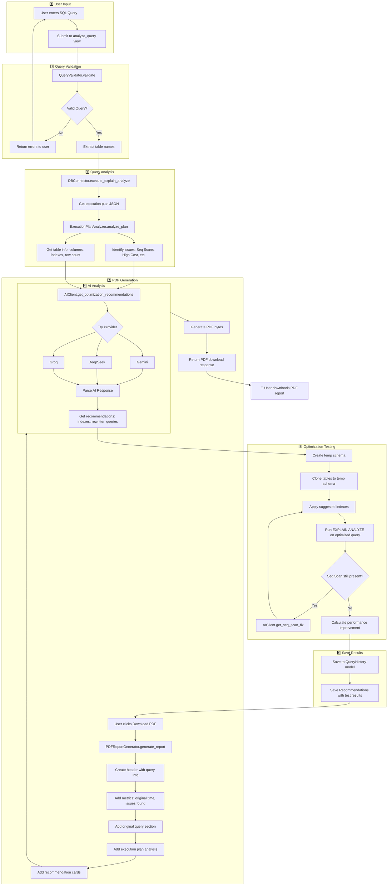

# PostgreSQL Query Tuning Advisor 🚀

AI-powered query optimization tool for PostgreSQL databases. Analyzes your SQL queries, provides optimization recommendations using AI (Gemini/DeepSeek/Groq), and tests them automatically.

## Features

- 🔍 **Query Analysis** - Run EXPLAIN ANALYZE and get detailed execution plans
- 🤖 **AI Recommendations** - Get optimization suggestions from AI (Gemini, DeepSeek, or Groq)
- 🧪 **Automatic Testing** - Test recommendations using temporary tables
- 📊 **Performance Comparison** - Compare execution times before and after optimization
- 🔒 **Secure Connections** - Database credentials are encrypted

## Application Logic Flow

This section explains how the application processes a query from input to PDF report generation.

### Flow Diagram



### Step-by-Step Process

#### 1️⃣ User Input
- User enters a SQL query through the web interface
- Query is submitted to the `analyze_query` view in `views.py`

#### 2️⃣ Query Validation (`query_analyzer.py`)
- **QueryValidator** checks for:
  - Dangerous operations (DROP, DELETE, TRUNCATE, ALTER, etc.)
  - Query patterns that may cause performance issues
  - Extracts table names from the query

#### 3️⃣ Query Analysis (`db_connector.py` + `query_analyzer.py`)
- **DBConnector** executes `EXPLAIN (ANALYZE, BUFFERS, FORMAT JSON)` on the query
- **ExecutionPlanAnalyzer** parses the execution plan to identify:
  - Sequential Scans (Seq Scan)
  - High-cost operations
  - Missing indexes
  - Execution time and row estimates

#### 4️⃣ AI Analysis (`gemini_client.py`)
- **AIClient** sends query + execution plan + table info to AI provider
- Uses fallback mechanism: Gemini → DeepSeek → Groq
- AI returns structured recommendations:
  ```json
  {
    "type": "index" | "rewrite" | "config",
    "description": "Optimization description",
    "suggested_indexes": ["CREATE INDEX ..."],
    "rewritten_query": "SELECT ...",
    "expected_improvement": "high" | "medium" | "low"
  }
  ```

#### 5️⃣ Optimization Testing (`optimizer.py`)
- **QueryOptimizer** creates temporary schema for safe testing
- Clones relevant tables with data
- Applies suggested indexes on temp tables
- Runs the query with optimizations applied
- If Sequential Scan persists, requests AI to fix it (up to 5 attempts)
- Calculates actual performance improvement

#### 6️⃣ Save Results
- **QueryHistory** model stores: original query, execution plan, execution time
- **Recommendation** model stores: each AI recommendation with test results
- Stores accumulated indexes and optimization attempts in `gemini_raw_response`

#### 7️⃣ PDF Generation (`pdf_generator.py`)
- **PDFReportGenerator** creates professional PDF report:
  - Header with database info and timestamp
  - Summary metrics (original time, recommendations count)
  - Original query with syntax highlighting
  - Execution plan summary with scan type analysis
  - Recommendation cards showing:
    - Applied indexes
    - Rewritten query (if any)
    - Performance comparison (before/after times)
    - Iteration count and optimization attempts

### Key Components

| Component | File | Responsibility |
|-----------|------|----------------|
| View Controller | `views.py` | Handle HTTP requests, orchestrate flow |
| Query Validator | `query_analyzer.py` | Validate SQL, extract tables |
| Plan Analyzer | `query_analyzer.py` | Parse EXPLAIN output, identify issues |
| DB Connector | `db_connector.py` | Execute queries, manage temp schemas |
| AI Client | `gemini_client.py` | Get recommendations from AI providers |
| Optimizer | `optimizer.py` | Test recommendations with temp tables |
| PDF Generator | `pdf_generator.py` | Generate downloadable PDF reports |

## Tech Stack

- **Backend**: Django 4.2
- **Database**: PostgreSQL (Vercel Postgres supported)
- **AI Providers**: Google Gemini, DeepSeek, Groq (with automatic fallback)
- **Deployment**: Vercel (serverless)

## Quick Start (Local Development)

```bash
# Clone the repository
git clone https://github.com/yourusername/tuning-buddy.git
cd tuning-buddy

# Create virtual environment
python -m venv venv
source venv/bin/activate  # On Windows: venv\Scripts\activate

# Install dependencies
pip install -r requirements.txt

# Copy environment file
cp .env.example .env
# Edit .env with your settings

# Run migrations
python manage.py migrate

# Collect static files
python manage.py collectstatic --noinput

# Start development server
python manage.py runserver
```

## Deploy to Vercel

### 1. Prerequisites

- [Vercel Account](https://vercel.com)
- [Vercel CLI](https://vercel.com/cli) installed
- PostgreSQL database (Vercel Postgres or external)

### 2. Set Environment Variables in Vercel

Go to your Vercel project settings → Environment Variables and add:

| Variable | Description | Required |
|----------|-------------|----------|
| `SECRET_KEY` | Django secret key | ✅ |
| `DEBUG` | Set to `False` | ✅ |
| `DATABASE_URL` | PostgreSQL connection string | ✅ |
| `ENCRYPTION_KEY` | Fernet key for encrypting credentials | ✅ |
| `GEMINI_API_KEY` | Google Gemini API key | At least one AI key |
| `DEEPSEEK_API_KEY` | DeepSeek API key | At least one AI key |
| `GROQ_API_KEY` | Groq API key (FREE) | At least one AI key |

### 3. Deploy

```bash
# Login to Vercel
vercel login

# Deploy
vercel --prod
```

### 4. Run Migrations on Production

After deployment, run migrations using Vercel CLI or by adding a build command.

## AI Provider Priority

The app uses AI providers in this order:
1. **Gemini** (Google) - First choice
2. **DeepSeek** - Second choice
3. **Groq** (FREE) - Fallback

If one provider fails (quota exceeded, error), it automatically tries the next one.

## Generate Encryption Key

```python
python -c "from cryptography.fernet import Fernet; print(Fernet.generate_key().decode())"
```

## Generate Secret Key

```python
python -c "from django.core.management.utils import get_random_secret_key; print(get_random_secret_key())"
```

## Project Structure

```
tuning-buddy/
├── advisor/                 # Main Django app
│   ├── models.py           # Database models
│   ├── views.py            # View controllers
│   ├── services/           # Business logic
│   │   ├── db_connector.py # PostgreSQL connection handler
│   │   ├── gemini_client.py# AI client (multi-provider)
│   │   ├── optimizer.py    # Query optimization logic
│   │   └── query_analyzer.py# SQL parsing & analysis
│   └── templates/          # HTML templates
├── static/css/             # Stylesheets
├── tuning_buddy/           # Django project settings
├── requirements.txt        # Python dependencies
└── vercel.json            # Vercel config
```

## License

MIT License
